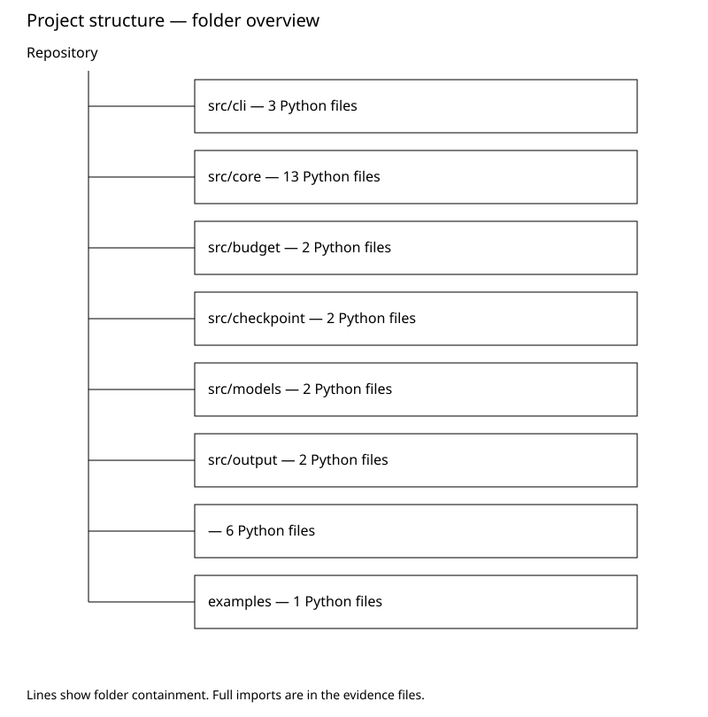

# Deep Research Scan

Шинэ skill-ийн agent review: [ойлгомжтой дүгнэлт, нотолгоо, дараагийн алхам](agent-review.md).
Local pypdf нь 6.1.1; declaration нь >=6.1.3. Installed-version security
advisory болон local caller-ийг тусад нь тулгасан дэлгэрэнгүйг review-д үзнэ.

Status: COLLECTED | Checked: 2026-10-09T13:31:57.667338+00:00
Scope: C:\Users\hotar\OneDrive\Desktop\AgentCore

## Summary

330 dependency declarations; 94 Python modules; 43 static findings.
External research approval required: False

## Local / GitHub

{
  "local_head": "d4e3db78a550c81dc3f260188637753e8813af3a",
  "dirty": true,
  "remote_head": "d4e3db78a550c81dc3f260188637753e8813af3a",
  "comparison": {
    "status": "identical",
    "ahead_by": 0,
    "behind_by": 0,
    "total_commits": 0
  },
  "changed_files": [],
  "comparison_boundary": "GitHub file list may be truncated; compares committed HEAD, not dirty files."
}

## Dependencies

| Package | Location | Declared / exact | Latest | Advisory status |
|---|---|---|---|---|
| @isaacs/fs-minipass | examples/backend/express/package-lock.json | lockfile / 4.0.1 | unknown | UNKNOWN |
| abbrev | examples/backend/express/package-lock.json | lockfile / 4.0.0 | unknown | UNKNOWN |
| accepts | examples/backend/express/package-lock.json | lockfile / 1.3.8 | unknown | UNKNOWN |
| array-flatten | examples/backend/express/package-lock.json | lockfile / 1.1.1 | unknown | UNKNOWN |
| base64-js | examples/backend/express/package-lock.json | lockfile / 1.5.1 | unknown | UNKNOWN |
| bindings | examples/backend/express/package-lock.json | lockfile / 1.5.0 | unknown | UNKNOWN |
| bl | examples/backend/express/package-lock.json | lockfile / 4.1.0 | unknown | UNKNOWN |
| body-parser | examples/backend/express/package-lock.json | lockfile / 1.20.8 | unknown | UNKNOWN |
| buffer | examples/backend/express/package-lock.json | lockfile / 5.7.1 | unknown | UNKNOWN |
| bytes | examples/backend/express/package-lock.json | lockfile / 3.1.2 | unknown | UNKNOWN |
| call-bind-apply-helpers | examples/backend/express/package-lock.json | lockfile / 1.0.2 | unknown | UNKNOWN |
| call-bound | examples/backend/express/package-lock.json | lockfile / 1.0.4 | unknown | UNKNOWN |
| chownr | examples/backend/express/package-lock.json | lockfile / 3.0.0 | unknown | UNKNOWN |
| content-disposition | examples/backend/express/package-lock.json | lockfile / 0.5.4 | unknown | UNKNOWN |
| content-type | examples/backend/express/package-lock.json | lockfile / 1.0.5 | unknown | UNKNOWN |
| cookie | examples/backend/express/package-lock.json | lockfile / 0.7.2 | unknown | UNKNOWN |
| cookie-signature | examples/backend/express/package-lock.json | lockfile / 1.0.7 | unknown | UNKNOWN |
| debug | examples/backend/express/package-lock.json | lockfile / 2.6.9 | unknown | UNKNOWN |
| decompress-response | examples/backend/express/package-lock.json | lockfile / 6.0.0 | unknown | UNKNOWN |
| deep-extend | examples/backend/express/package-lock.json | lockfile / 0.6.0 | unknown | UNKNOWN |
| depd | examples/backend/express/package-lock.json | lockfile / 2.0.0 | unknown | UNKNOWN |
| destroy | examples/backend/express/package-lock.json | lockfile / 1.2.0 | unknown | UNKNOWN |
| detect-libc | examples/backend/express/package-lock.json | lockfile / 2.1.2 | unknown | UNKNOWN |
| dunder-proto | examples/backend/express/package-lock.json | lockfile / 1.0.1 | unknown | UNKNOWN |
| ee-first | examples/backend/express/package-lock.json | lockfile / 1.1.1 | unknown | UNKNOWN |
| encodeurl | examples/backend/express/package-lock.json | lockfile / 2.0.0 | unknown | UNKNOWN |
| end-of-stream | examples/backend/express/package-lock.json | lockfile / 1.4.5 | unknown | UNKNOWN |
| env-paths | examples/backend/express/package-lock.json | lockfile / 2.2.1 | unknown | UNKNOWN |
| es-define-property | examples/backend/express/package-lock.json | lockfile / 1.0.1 | unknown | UNKNOWN |
| es-errors | examples/backend/express/package-lock.json | lockfile / 1.3.0 | unknown | UNKNOWN |
| es-object-atoms | examples/backend/express/package-lock.json | lockfile / 1.1.2 | unknown | UNKNOWN |
| escape-html | examples/backend/express/package-lock.json | lockfile / 1.0.3 | unknown | UNKNOWN |
| etag | examples/backend/express/package-lock.json | lockfile / 1.8.1 | unknown | UNKNOWN |
| expand-template | examples/backend/express/package-lock.json | lockfile / 2.0.3 | unknown | UNKNOWN |
| exponential-backoff | examples/backend/express/package-lock.json | lockfile / 3.1.3 | unknown | UNKNOWN |
| express | examples/backend/express/package-lock.json | lockfile / 4.22.3 | unknown | UNKNOWN |
| fdir | examples/backend/express/package-lock.json | lockfile / 6.5.0 | unknown | UNKNOWN |
| file-uri-to-path | examples/backend/express/package-lock.json | lockfile / 1.0.0 | unknown | UNKNOWN |
| finalhandler | examples/backend/express/package-lock.json | lockfile / 1.3.2 | unknown | UNKNOWN |
| forwarded | examples/backend/express/package-lock.json | lockfile / 0.2.0 | unknown | UNKNOWN |
| fresh | examples/backend/express/package-lock.json | lockfile / 0.5.2 | unknown | UNKNOWN |
| fs-constants | examples/backend/express/package-lock.json | lockfile / 1.0.0 | unknown | UNKNOWN |
| function-bind | examples/backend/express/package-lock.json | lockfile / 1.1.2 | unknown | UNKNOWN |
| get-intrinsic | examples/backend/express/package-lock.json | lockfile / 1.3.0 | unknown | UNKNOWN |
| get-proto | examples/backend/express/package-lock.json | lockfile / 1.0.1 | unknown | UNKNOWN |
| github-from-package | examples/backend/express/package-lock.json | lockfile / 0.0.0 | unknown | UNKNOWN |
| gopd | examples/backend/express/package-lock.json | lockfile / 1.2.0 | unknown | UNKNOWN |
| graceful-fs | examples/backend/express/package-lock.json | lockfile / 4.2.11 | unknown | UNKNOWN |
| has-symbols | examples/backend/express/package-lock.json | lockfile / 1.1.0 | unknown | UNKNOWN |
| hasown | examples/backend/express/package-lock.json | lockfile / 2.0.4 | unknown | UNKNOWN |
| http-errors | examples/backend/express/package-lock.json | lockfile / 2.0.1 | unknown | UNKNOWN |
| iconv-lite | examples/backend/express/package-lock.json | lockfile / 0.4.24 | unknown | UNKNOWN |
| ieee754 | examples/backend/express/package-lock.json | lockfile / 1.2.1 | unknown | UNKNOWN |
| inherits | examples/backend/express/package-lock.json | lockfile / 2.0.4 | unknown | UNKNOWN |
| ini | examples/backend/express/package-lock.json | lockfile / 1.3.8 | unknown | UNKNOWN |
| ipaddr.js | examples/backend/express/package-lock.json | lockfile / 1.9.1 | unknown | UNKNOWN |
| isexe | examples/backend/express/package-lock.json | lockfile / 4.0.0 | unknown | UNKNOWN |
| math-intrinsics | examples/backend/express/package-lock.json | lockfile / 1.1.0 | unknown | UNKNOWN |
| media-typer | examples/backend/express/package-lock.json | lockfile / 0.3.0 | unknown | UNKNOWN |
| merge-descriptors | examples/backend/express/package-lock.json | lockfile / 1.0.3 | unknown | UNKNOWN |
| methods | examples/backend/express/package-lock.json | lockfile / 1.1.2 | unknown | UNKNOWN |
| mime | examples/backend/express/package-lock.json | lockfile / 1.6.0 | unknown | UNKNOWN |
| mime-db | examples/backend/express/package-lock.json | lockfile / 1.52.0 | unknown | UNKNOWN |
| mime-types | examples/backend/express/package-lock.json | lockfile / 2.1.35 | unknown | UNKNOWN |
| mimic-response | examples/backend/express/package-lock.json | lockfile / 3.1.0 | unknown | UNKNOWN |
| minimist | examples/backend/express/package-lock.json | lockfile / 1.2.8 | unknown | UNKNOWN |
| minipass | examples/backend/express/package-lock.json | lockfile / 7.1.3 | unknown | UNKNOWN |
| minizlib | examples/backend/express/package-lock.json | lockfile / 3.1.0 | unknown | UNKNOWN |
| mkdirp-classic | examples/backend/express/package-lock.json | lockfile / 0.5.3 | unknown | UNKNOWN |
| ms | examples/backend/express/package-lock.json | lockfile / 2.0.0 | unknown | UNKNOWN |
| napi-build-utils | examples/backend/express/package-lock.json | lockfile / 2.0.0 | unknown | UNKNOWN |
| negotiator | examples/backend/express/package-lock.json | lockfile / 0.6.3 | unknown | UNKNOWN |
| node-abi | examples/backend/express/package-lock.json | lockfile / 3.95.0 | unknown | UNKNOWN |
| node-addon-api | examples/backend/express/package-lock.json | lockfile / 8.9.2 | unknown | UNKNOWN |
| node-fetch | examples/backend/express/package-lock.json | lockfile / 2.7.0 | unknown | UNKNOWN |
| node-gyp | examples/backend/express/package-lock.json | lockfile / 12.4.0 | unknown | UNKNOWN |
| nopt | examples/backend/express/package-lock.json | lockfile / 9.0.0 | unknown | UNKNOWN |
| object-inspect | examples/backend/express/package-lock.json | lockfile / 1.13.4 | unknown | UNKNOWN |
| on-finished | examples/backend/express/package-lock.json | lockfile / 2.4.1 | unknown | UNKNOWN |
| once | examples/backend/express/package-lock.json | lockfile / 1.4.0 | unknown | UNKNOWN |
| parseurl | examples/backend/express/package-lock.json | lockfile / 1.3.3 | unknown | UNKNOWN |
| path-to-regexp | examples/backend/express/package-lock.json | lockfile / 0.1.13 | unknown | UNKNOWN |
| picomatch | examples/backend/express/package-lock.json | lockfile / 4.0.7 | unknown | UNKNOWN |
| prebuild-install | examples/backend/express/package-lock.json | lockfile / 7.1.3 | unknown | UNKNOWN |
| proc-log | examples/backend/express/package-lock.json | lockfile / 6.1.0 | unknown | UNKNOWN |
| proxy-addr | examples/backend/express/package-lock.json | lockfile / 2.0.8 | unknown | UNKNOWN |
| pump | examples/backend/express/package-lock.json | lockfile / 3.0.4 | unknown | UNKNOWN |
| qs | examples/backend/express/package-lock.json | lockfile / 6.16.0 | unknown | UNKNOWN |
| range-parser | examples/backend/express/package-lock.json | lockfile / 1.2.1 | unknown | UNKNOWN |
| raw-body | examples/backend/express/package-lock.json | lockfile / 2.5.3 | unknown | UNKNOWN |
| rc | examples/backend/express/package-lock.json | lockfile / 1.2.8 | unknown | UNKNOWN |
| readable-stream | examples/backend/express/package-lock.json | lockfile / 3.6.2 | unknown | UNKNOWN |
| safe-buffer | examples/backend/express/package-lock.json | lockfile / 5.2.1 | unknown | UNKNOWN |
| safer-buffer | examples/backend/express/package-lock.json | lockfile / 2.1.2 | unknown | UNKNOWN |
| semver | examples/backend/express/package-lock.json | lockfile / 7.8.5 | unknown | UNKNOWN |
| send | examples/backend/express/package-lock.json | lockfile / 0.19.2 | unknown | UNKNOWN |
| ms | examples/backend/express/package-lock.json | lockfile / 2.1.3 | unknown | UNKNOWN |
| serve-static | examples/backend/express/package-lock.json | lockfile / 1.16.3 | unknown | UNKNOWN |
| setprototypeof | examples/backend/express/package-lock.json | lockfile / 1.2.0 | unknown | UNKNOWN |
| side-channel | examples/backend/express/package-lock.json | lockfile / 1.1.1 | unknown | UNKNOWN |
| side-channel-list | examples/backend/express/package-lock.json | lockfile / 1.0.1 | unknown | UNKNOWN |
| side-channel-map | examples/backend/express/package-lock.json | lockfile / 1.0.1 | unknown | UNKNOWN |
| side-channel-weakmap | examples/backend/express/package-lock.json | lockfile / 1.0.2 | unknown | UNKNOWN |
| simple-concat | examples/backend/express/package-lock.json | lockfile / 1.0.1 | unknown | UNKNOWN |
| simple-get | examples/backend/express/package-lock.json | lockfile / 4.0.1 | unknown | UNKNOWN |
| sqlite | examples/backend/express/package-lock.json | lockfile / 5.1.1 | unknown | UNKNOWN |
| sqlite3 | examples/backend/express/package-lock.json | lockfile / 6.0.1 | unknown | UNKNOWN |
| statuses | examples/backend/express/package-lock.json | lockfile / 2.0.2 | unknown | UNKNOWN |
| string_decoder | examples/backend/express/package-lock.json | lockfile / 1.3.0 | unknown | UNKNOWN |
| strip-json-comments | examples/backend/express/package-lock.json | lockfile / 2.0.1 | unknown | UNKNOWN |
| tar | examples/backend/express/package-lock.json | lockfile / 7.5.22 | unknown | UNKNOWN |
| tar-fs | examples/backend/express/package-lock.json | lockfile / 2.1.5 | unknown | UNKNOWN |
| chownr | examples/backend/express/package-lock.json | lockfile / 1.1.4 | unknown | UNKNOWN |
| tar-stream | examples/backend/express/package-lock.json | lockfile / 2.2.0 | unknown | UNKNOWN |
| tinyglobby | examples/backend/express/package-lock.json | lockfile / 0.2.17 | unknown | UNKNOWN |
| toidentifier | examples/backend/express/package-lock.json | lockfile / 1.0.1 | unknown | UNKNOWN |
| tr46 | examples/backend/express/package-lock.json | lockfile / 0.0.3 | unknown | UNKNOWN |
| tunnel-agent | examples/backend/express/package-lock.json | lockfile / 0.6.0 | unknown | UNKNOWN |
| type-is | examples/backend/express/package-lock.json | lockfile / 1.6.18 | unknown | UNKNOWN |
| undici | examples/backend/express/package-lock.json | lockfile / 6.29.0 | unknown | UNKNOWN |
| unpipe | examples/backend/express/package-lock.json | lockfile / 1.0.0 | unknown | UNKNOWN |
| util-deprecate | examples/backend/express/package-lock.json | lockfile / 1.0.2 | unknown | UNKNOWN |
| utils-merge | examples/backend/express/package-lock.json | lockfile / 1.0.1 | unknown | UNKNOWN |
| vary | examples/backend/express/package-lock.json | lockfile / 1.1.2 | unknown | UNKNOWN |
| webidl-conversions | examples/backend/express/package-lock.json | lockfile / 3.0.1 | unknown | UNKNOWN |
| whatwg-url | examples/backend/express/package-lock.json | lockfile / 5.0.0 | unknown | UNKNOWN |
| which | examples/backend/express/package-lock.json | lockfile / 6.0.1 | unknown | UNKNOWN |
| wrappy | examples/backend/express/package-lock.json | lockfile / 1.0.2 | unknown | UNKNOWN |
| yallist | examples/backend/express/package-lock.json | lockfile / 5.0.0 | unknown | UNKNOWN |
| express | examples/backend/express/package.json | ^4.22.0 / unknown | unknown | UNKNOWN |
| node-fetch | examples/backend/express/package.json | ^2.7.0 / unknown | unknown | UNKNOWN |
| sqlite | examples/backend/express/package.json | ^5.1.1 / unknown | unknown | UNKNOWN |
| sqlite3 | examples/backend/express/package.json | ^6.0.1 / unknown | unknown | UNKNOWN |
| @agentcore/assistant | package-lock.json | lockfile / unknown | unknown | UNKNOWN |
| @agentcore/mcp | package-lock.json | lockfile / unknown | unknown | UNKNOWN |
| @agentcore/types | package-lock.json | lockfile / unknown | unknown | UNKNOWN |
| @esbuild/aix-ppc64 | package-lock.json | lockfile / 0.28.2 | unknown | UNKNOWN |
| @esbuild/android-arm | package-lock.json | lockfile / 0.28.2 | unknown | UNKNOWN |
| @esbuild/android-arm64 | package-lock.json | lockfile / 0.28.2 | unknown | UNKNOWN |
| @esbuild/android-x64 | package-lock.json | lockfile / 0.28.2 | unknown | UNKNOWN |
| @esbuild/darwin-arm64 | package-lock.json | lockfile / 0.28.2 | unknown | UNKNOWN |
| @esbuild/darwin-x64 | package-lock.json | lockfile / 0.28.2 | unknown | UNKNOWN |
| @esbuild/freebsd-arm64 | package-lock.json | lockfile / 0.28.2 | unknown | UNKNOWN |
| @esbuild/freebsd-x64 | package-lock.json | lockfile / 0.28.2 | unknown | UNKNOWN |
| @esbuild/linux-arm | package-lock.json | lockfile / 0.28.2 | unknown | UNKNOWN |
| @esbuild/linux-arm64 | package-lock.json | lockfile / 0.28.2 | unknown | UNKNOWN |
| @esbuild/linux-ia32 | package-lock.json | lockfile / 0.28.2 | unknown | UNKNOWN |
| @esbuild/linux-loong64 | package-lock.json | lockfile / 0.28.2 | unknown | UNKNOWN |
| @esbuild/linux-mips64el | package-lock.json | lockfile / 0.28.2 | unknown | UNKNOWN |
| @esbuild/linux-ppc64 | package-lock.json | lockfile / 0.28.2 | unknown | UNKNOWN |
| @esbuild/linux-riscv64 | package-lock.json | lockfile / 0.28.2 | unknown | UNKNOWN |
| @esbuild/linux-s390x | package-lock.json | lockfile / 0.28.2 | unknown | UNKNOWN |
| @esbuild/linux-x64 | package-lock.json | lockfile / 0.28.2 | unknown | UNKNOWN |
| @esbuild/netbsd-arm64 | package-lock.json | lockfile / 0.28.2 | unknown | UNKNOWN |
| @esbuild/netbsd-x64 | package-lock.json | lockfile / 0.28.2 | unknown | UNKNOWN |
| @esbuild/openbsd-arm64 | package-lock.json | lockfile / 0.28.2 | unknown | UNKNOWN |
| @esbuild/openbsd-x64 | package-lock.json | lockfile / 0.28.2 | unknown | UNKNOWN |
| @esbuild/openharmony-arm64 | package-lock.json | lockfile / 0.28.2 | unknown | UNKNOWN |
| @esbuild/sunos-x64 | package-lock.json | lockfile / 0.28.2 | unknown | UNKNOWN |
| @esbuild/win32-arm64 | package-lock.json | lockfile / 0.28.2 | unknown | UNKNOWN |
| @esbuild/win32-ia32 | package-lock.json | lockfile / 0.28.2 | unknown | UNKNOWN |
| @esbuild/win32-x64 | package-lock.json | lockfile / 0.28.2 | unknown | UNKNOWN |
| @hono/node-server | package-lock.json | lockfile / 2.1.3 | unknown | UNKNOWN |
| @jridgewell/sourcemap-codec | package-lock.json | lockfile / 1.6.0 | unknown | UNKNOWN |
| @modelcontextprotocol/sdk | package-lock.json | lockfile / 1.32.1 | unknown | UNKNOWN |
| @types/estree | package-lock.json | lockfile / 1.0.9 | unknown | UNKNOWN |
| @types/node | package-lock.json | lockfile / 22.20.5 | unknown | UNKNOWN |
| @types/uuid | package-lock.json | lockfile / 10.0.0 | unknown | UNKNOWN |
| @vitest/expect | package-lock.json | lockfile / 2.1.9 | unknown | UNKNOWN |
| @vitest/mocker | package-lock.json | lockfile / 2.1.9 | unknown | UNKNOWN |
| @vitest/pretty-format | package-lock.json | lockfile / 2.1.9 | unknown | UNKNOWN |
| @vitest/runner | package-lock.json | lockfile / 2.1.9 | unknown | UNKNOWN |
| @vitest/snapshot | package-lock.json | lockfile / 2.1.9 | unknown | UNKNOWN |
| @vitest/spy | package-lock.json | lockfile / 2.1.9 | unknown | UNKNOWN |
| @vitest/utils | package-lock.json | lockfile / 2.1.9 | unknown | UNKNOWN |
| accepts | package-lock.json | lockfile / 2.0.0 | unknown | UNKNOWN |
| ajv | package-lock.json | lockfile / 8.20.0 | unknown | UNKNOWN |
| ajv-formats | package-lock.json | lockfile / 3.0.1 | unknown | UNKNOWN |
| assertion-error | package-lock.json | lockfile / 2.0.1 | unknown | UNKNOWN |
| body-parser | package-lock.json | lockfile / 2.3.0 | unknown | UNKNOWN |
| content-type | package-lock.json | lockfile / 2.1.0 | unknown | UNKNOWN |
| bytes | package-lock.json | lockfile / 3.1.2 | unknown | UNKNOWN |
| cac | package-lock.json | lockfile / 6.7.14 | unknown | UNKNOWN |
| call-bind-apply-helpers | package-lock.json | lockfile / 1.0.2 | unknown | UNKNOWN |
| call-bound | package-lock.json | lockfile / 1.0.4 | unknown | UNKNOWN |
| chai | package-lock.json | lockfile / 5.3.3 | unknown | UNKNOWN |
| check-error | package-lock.json | lockfile / 2.1.3 | unknown | UNKNOWN |
| content-disposition | package-lock.json | lockfile / 1.1.0 | unknown | UNKNOWN |
| content-type | package-lock.json | lockfile / 1.0.5 | unknown | UNKNOWN |
| cookie | package-lock.json | lockfile / 0.7.2 | unknown | UNKNOWN |
| cookie-signature | package-lock.json | lockfile / 1.2.2 | unknown | UNKNOWN |
| cors | package-lock.json | lockfile / 2.8.6 | unknown | UNKNOWN |
| cross-spawn | package-lock.json | lockfile / 7.0.6 | unknown | UNKNOWN |
| debug | package-lock.json | lockfile / 4.4.3 | unknown | UNKNOWN |
| deep-eql | package-lock.json | lockfile / 5.0.2 | unknown | UNKNOWN |
| depd | package-lock.json | lockfile / 2.0.0 | unknown | UNKNOWN |
| dunder-proto | package-lock.json | lockfile / 1.0.1 | unknown | UNKNOWN |
| ee-first | package-lock.json | lockfile / 1.1.1 | unknown | UNKNOWN |
| encodeurl | package-lock.json | lockfile / 2.0.0 | unknown | UNKNOWN |
| es-define-property | package-lock.json | lockfile / 1.0.1 | unknown | UNKNOWN |
| es-errors | package-lock.json | lockfile / 1.3.0 | unknown | UNKNOWN |
| es-module-lexer | package-lock.json | lockfile / 1.7.0 | unknown | UNKNOWN |
| es-object-atoms | package-lock.json | lockfile / 1.1.2 | unknown | UNKNOWN |
| esbuild | package-lock.json | lockfile / 0.28.2 | unknown | UNKNOWN |
| escape-html | package-lock.json | lockfile / 1.0.3 | unknown | UNKNOWN |
| estree-walker | package-lock.json | lockfile / 3.0.3 | unknown | UNKNOWN |
| etag | package-lock.json | lockfile / 1.8.1 | unknown | UNKNOWN |
| eventemitter3 | package-lock.json | lockfile / 5.0.4 | unknown | UNKNOWN |
| eventsource | package-lock.json | lockfile / 3.0.7 | unknown | UNKNOWN |
| eventsource-parser | package-lock.json | lockfile / 3.1.1 | unknown | UNKNOWN |
| expect-type | package-lock.json | lockfile / 1.4.0 | unknown | UNKNOWN |
| express | package-lock.json | lockfile / 5.2.1 | unknown | UNKNOWN |
| express-rate-limit | package-lock.json | lockfile / 8.7.1 | unknown | UNKNOWN |
| fast-deep-equal | package-lock.json | lockfile / 3.1.3 | unknown | UNKNOWN |
| fast-uri | package-lock.json | lockfile / 3.1.8 | unknown | UNKNOWN |
| finalhandler | package-lock.json | lockfile / 2.1.1 | unknown | UNKNOWN |
| forwarded | package-lock.json | lockfile / 0.2.0 | unknown | UNKNOWN |
| fresh | package-lock.json | lockfile / 2.0.0 | unknown | UNKNOWN |
| fsevents | package-lock.json | lockfile / 2.3.3 | unknown | UNKNOWN |
| function-bind | package-lock.json | lockfile / 1.1.2 | unknown | UNKNOWN |
| get-intrinsic | package-lock.json | lockfile / 1.3.0 | unknown | UNKNOWN |
| get-proto | package-lock.json | lockfile / 1.0.1 | unknown | UNKNOWN |
| gopd | package-lock.json | lockfile / 1.2.0 | unknown | UNKNOWN |
| has-symbols | package-lock.json | lockfile / 1.1.0 | unknown | UNKNOWN |
| hasown | package-lock.json | lockfile / 2.0.4 | unknown | UNKNOWN |
| hono | package-lock.json | lockfile / 4.13.13 | unknown | UNKNOWN |
| http-errors | package-lock.json | lockfile / 2.0.1 | unknown | UNKNOWN |
| iconv-lite | package-lock.json | lockfile / 0.7.3 | unknown | UNKNOWN |
| inherits | package-lock.json | lockfile / 2.0.4 | unknown | UNKNOWN |
| ip-address | package-lock.json | lockfile / 10.7.3 | unknown | UNKNOWN |
| ipaddr.js | package-lock.json | lockfile / 1.9.1 | unknown | UNKNOWN |
| is-promise | package-lock.json | lockfile / 4.0.0 | unknown | UNKNOWN |
| isexe | package-lock.json | lockfile / 2.0.0 | unknown | UNKNOWN |
| jose | package-lock.json | lockfile / 6.2.12 | unknown | UNKNOWN |
| json-schema-traverse | package-lock.json | lockfile / 1.0.0 | unknown | UNKNOWN |
| json-schema-typed | package-lock.json | lockfile / 8.0.2 | unknown | UNKNOWN |
| loupe | package-lock.json | lockfile / 3.2.1 | unknown | UNKNOWN |
| magic-string | package-lock.json | lockfile / 0.30.21 | unknown | UNKNOWN |
| math-intrinsics | package-lock.json | lockfile / 1.1.0 | unknown | UNKNOWN |
| media-typer | package-lock.json | lockfile / 1.1.1 | unknown | UNKNOWN |
| merge-descriptors | package-lock.json | lockfile / 2.0.0 | unknown | UNKNOWN |
| mime-db | package-lock.json | lockfile / 1.54.0 | unknown | UNKNOWN |
| mime-types | package-lock.json | lockfile / 3.0.2 | unknown | UNKNOWN |
| ms | package-lock.json | lockfile / 2.1.3 | unknown | UNKNOWN |
| negotiator | package-lock.json | lockfile / 1.1.0 | unknown | UNKNOWN |
| content-type | package-lock.json | lockfile / 2.1.0 | unknown | UNKNOWN |
| object-assign | package-lock.json | lockfile / 4.1.1 | unknown | UNKNOWN |
| object-inspect | package-lock.json | lockfile / 1.13.4 | unknown | UNKNOWN |
| on-finished | package-lock.json | lockfile / 2.4.1 | unknown | UNKNOWN |
| once | package-lock.json | lockfile / 1.4.0 | unknown | UNKNOWN |
| parseurl | package-lock.json | lockfile / 1.3.3 | unknown | UNKNOWN |
| path-key | package-lock.json | lockfile / 3.1.1 | unknown | UNKNOWN |
| path-to-regexp | package-lock.json | lockfile / 8.4.2 | unknown | UNKNOWN |
| pathe | package-lock.json | lockfile / 1.1.2 | unknown | UNKNOWN |
| pathval | package-lock.json | lockfile / 2.0.1 | unknown | UNKNOWN |
| pkce-challenge | package-lock.json | lockfile / 5.0.1 | unknown | UNKNOWN |
| proxy-addr | package-lock.json | lockfile / 2.0.8 | unknown | UNKNOWN |
| qs | package-lock.json | lockfile / 6.16.0 | unknown | UNKNOWN |
| range-parser | package-lock.json | lockfile / 1.3.0 | unknown | UNKNOWN |
| raw-body | package-lock.json | lockfile / 3.0.2 | unknown | UNKNOWN |
| require-from-string | package-lock.json | lockfile / 2.0.2 | unknown | UNKNOWN |
| router | package-lock.json | lockfile / 2.2.0 | unknown | UNKNOWN |
| safer-buffer | package-lock.json | lockfile / 2.1.2 | unknown | UNKNOWN |
| send | package-lock.json | lockfile / 1.2.1 | unknown | UNKNOWN |
| serve-static | package-lock.json | lockfile / 2.2.1 | unknown | UNKNOWN |
| setprototypeof | package-lock.json | lockfile / 1.2.0 | unknown | UNKNOWN |
| shebang-command | package-lock.json | lockfile / 2.0.0 | unknown | UNKNOWN |
| shebang-regex | package-lock.json | lockfile / 3.0.0 | unknown | UNKNOWN |
| side-channel | package-lock.json | lockfile / 1.1.1 | unknown | UNKNOWN |
| side-channel-list | package-lock.json | lockfile / 1.0.1 | unknown | UNKNOWN |
| side-channel-map | package-lock.json | lockfile / 1.0.1 | unknown | UNKNOWN |
| side-channel-weakmap | package-lock.json | lockfile / 1.0.2 | unknown | UNKNOWN |
| siginfo | package-lock.json | lockfile / 2.0.0 | unknown | UNKNOWN |
| stackback | package-lock.json | lockfile / 0.0.2 | unknown | UNKNOWN |
| statuses | package-lock.json | lockfile / 2.0.2 | unknown | UNKNOWN |
| std-env | package-lock.json | lockfile / 3.10.0 | unknown | UNKNOWN |
| tinybench | package-lock.json | lockfile / 2.9.0 | unknown | UNKNOWN |
| tinyexec | package-lock.json | lockfile / 0.3.2 | unknown | UNKNOWN |
| tinypool | package-lock.json | lockfile / 1.1.1 | unknown | UNKNOWN |
| tinyrainbow | package-lock.json | lockfile / 1.2.0 | unknown | UNKNOWN |
| tinyspy | package-lock.json | lockfile / 3.0.2 | unknown | UNKNOWN |
| toidentifier | package-lock.json | lockfile / 1.0.1 | unknown | UNKNOWN |
| tsx | package-lock.json | lockfile / 4.23.15 | unknown | UNKNOWN |
| type-is | package-lock.json | lockfile / 2.1.0 | unknown | UNKNOWN |
| content-type | package-lock.json | lockfile / 2.1.0 | unknown | UNKNOWN |
| typescript | package-lock.json | lockfile / 5.9.3 | unknown | UNKNOWN |
| undici-types | package-lock.json | lockfile / 6.21.0 | unknown | UNKNOWN |
| unpipe | package-lock.json | lockfile / 1.0.0 | unknown | UNKNOWN |
| uuid | package-lock.json | lockfile / 10.0.0 | unknown | UNKNOWN |
| vary | package-lock.json | lockfile / 1.1.2 | unknown | UNKNOWN |
| vite | package-lock.json | lockfile / unknown | unknown | UNKNOWN |
| vite-node | package-lock.json | lockfile / 2.1.9 | unknown | UNKNOWN |
| vitest | package-lock.json | lockfile / 2.1.9 | unknown | UNKNOWN |
| which | package-lock.json | lockfile / 2.0.2 | unknown | UNKNOWN |
| why-is-node-running | package-lock.json | lockfile / 2.3.0 | unknown | UNKNOWN |
| wrappy | package-lock.json | lockfile / 1.0.2 | unknown | UNKNOWN |
| zod | package-lock.json | lockfile / 3.25.76 | unknown | UNKNOWN |
| zod-to-json-schema | package-lock.json | lockfile / 3.25.2 | unknown | UNKNOWN |
| typescript | package.json | ^5.5.0 / unknown | unknown | UNKNOWN |
| tsx | package.json | ^4.16.0 / unknown | unknown | UNKNOWN |
| @agentcore/types | packages/agentcore-assistant/package.json | file:../agentcore-types / unknown | unknown | UNKNOWN |
| zod | packages/agentcore-assistant/package.json | ^3.23.0 / unknown | unknown | UNKNOWN |
| uuid | packages/agentcore-assistant/package.json | ^10.0.0 / unknown | unknown | UNKNOWN |
| eventemitter3 | packages/agentcore-assistant/package.json | ^5.0.0 / unknown | unknown | UNKNOWN |
| typescript | packages/agentcore-assistant/package.json | ^5.5.0 / unknown | unknown | UNKNOWN |
| vitest | packages/agentcore-assistant/package.json | ^2.0.0 / unknown | unknown | UNKNOWN |
| @types/node | packages/agentcore-assistant/package.json | ^22.0.0 / unknown | unknown | UNKNOWN |
| @types/uuid | packages/agentcore-assistant/package.json | ^10.0.0 / unknown | unknown | UNKNOWN |
| @agentcore/types | packages/agentcore-mcp/package.json | file:../agentcore-types / unknown | unknown | UNKNOWN |
| @agentcore/assistant | packages/agentcore-mcp/package.json | file:../agentcore-assistant / unknown | unknown | UNKNOWN |
| @modelcontextprotocol/sdk | packages/agentcore-mcp/package.json | ^1.0.0 / unknown | unknown | UNKNOWN |
| zod | packages/agentcore-mcp/package.json | ^3.23.0 / unknown | unknown | UNKNOWN |
| uuid | packages/agentcore-mcp/package.json | ^10.0.0 / unknown | unknown | UNKNOWN |
| typescript | packages/agentcore-mcp/package.json | ^5.5.0 / unknown | unknown | UNKNOWN |
| vitest | packages/agentcore-mcp/package.json | ^2.0.0 / unknown | unknown | UNKNOWN |
| @types/node | packages/agentcore-mcp/package.json | ^22.0.0 / unknown | unknown | UNKNOWN |
| @types/uuid | packages/agentcore-mcp/package.json | ^10.0.0 / unknown | unknown | UNKNOWN |
| zod | packages/agentcore-types/package.json | ^3.23.0 / unknown | unknown | UNKNOWN |
| typescript | packages/agentcore-types/package.json | ^5.5.0 / unknown | unknown | UNKNOWN |
| vitest | packages/agentcore-types/package.json | ^2.0.0 / unknown | unknown | UNKNOWN |
| zod | packages/agentcore-types/package.json | ^3.23.0 / unknown | unknown | UNKNOWN |
| @types/node | packages/agentcore-types/package.json | ^22.0.0 / unknown | unknown | UNKNOWN |
| reportlab | requirements-dev.txt:2 | >=4.0 / unknown | unknown | UNKNOWN |
| httpx | requirements-dev.txt:3 | >=0.27 / unknown | unknown | UNKNOWN |
| httpcore | requirements-dev.txt:4 | >=1.0.9 / unknown | unknown | UNKNOWN |
| pytest | requirements-dev.txt:5 | >=8.0 / unknown | unknown | UNKNOWN |
| pytest-asyncio | requirements-dev.txt:6 | >=0.23 / unknown | unknown | UNKNOWN |
| fastapi | requirements-dev.txt:7 | >=0.110 / unknown | unknown | UNKNOWN |
| uvicorn | requirements-dev.txt:8 | >=0.30 / unknown | unknown | UNKNOWN |
| pypdf | requirements.txt:1 | >=6.1.3 / unknown | 6.20.0 | UNKNOWN |

## Project structure

The overview shows folders and file counts, not execution flow. Detailed imports: [architecture notes](architecture/README.md).

## Duplicate candidates

- plugin/tests/test_plugin.py:30, plugin/tests/test_plugin.py:117
- src/ingestion/structured.py:14, src/ingestion/text.py:18

## Static evidence

Full Scan | root=C:\Users\hotar\OneDrive\Desktop\AgentCore | mode=strict | findings=43

### [1] Broad exception handler
- Location: .test_private_artifacts/full-scan/test_scan_reports_file_line_an0/sample.py:2
- Severity: MEDIUM
- Class: STATIC-RISK
- Root Cause proven: The code catches a broad exception class without visible classification.
- Root Cause hypoth.: The handler may intentionally be a boundary guard.
- Confidence: 0.58
- Impact: Scope=module | Blast=all callers | Timing=on failure | Recovery=manual review
- Reproduce: Get-Content .test_private_artifacts/full-scan/test_scan_reports_file_line_an0/sample.py | Select-Object -Skip 0 -First 8
- Fix: Catch the narrow exception types and preserve useful error context.
- Re-validate: python -m compileall .test_private_artifacts/full-scan/test_scan_reports_file_line_an0/sample.py
- Expected / Actual: No broad catch at this boundary / except Exception:
- Status: STATIC-RISK
- Proposed by: ai-agent
- Confirmed by: PENDING
- Evidence: static source evidence
- Boundary Note:

### [2] Possible hardcoded secret
- Location: .test_private_artifacts/full-scan-output/2026-10-09/fast/report.md:14
- Severity: HIGH
- Class: STATIC-RISK
- Root Cause proven: A credential-like assignment is present in source.
- Root Cause hypoth.: The value may be a test/example value.
- Confidence: 0.72
- Impact: Scope=file | Blast=all readers | Timing=on next deploy | Recovery=rotate secret
- Reproduce: rg -n -i 'api[_-]?key|password|secret|token' .test_private_artifacts/full-scan-output/2026-10-09/fast/report.md
- Fix: Move the value to environment/secret storage and rotate any real credential.
- Re-validate: rg -n -i 'api[_-]?key|password|secret|token' .test_private_artifacts/full-scan-output/2026-10-09/fast/report.md
- Expected / Actual: No credential-like literal / [REDACTED credential-like assignment]
- Status: STATIC-RISK
- Proposed by: ai-agent
- Confirmed by: PENDING
- Evidence: static source evidence
- Boundary Note: Secret validity requires external credential review.

### [3] Possible hardcoded secret
- Location: .test_private_artifacts/full-scan-output/2026-10-09/fast/report.md:32
- Severity: HIGH
- Class: STATIC-RISK
- Root Cause proven: A credential-like assignment is present in source.
- Root Cause hypoth.: The value may be a test/example value.
- Confidence: 0.72
- Impact: Scope=file | Blast=all readers | Timing=on next deploy | Recovery=rotate secret
- Reproduce: rg -n -i 'api[_-]?key|password|secret|token' .test_private_artifacts/full-scan-output/2026-10-09/fast/report.md
- Fix: Move the value to environment/secret storage and rotate any real credential.
- Re-validate: rg -n -i 'api[_-]?key|password|secret|token' .test_private_artifacts/full-scan-output/2026-10-09/fast/report.md
- Expected / Actual: No credential-like literal / [REDACTED credential-like assignment]
- Status: STATIC-RISK
- Proposed by: ai-agent
- Confirmed by: PENDING
- Evidence: static source evidence
- Boundary Note: Secret validity requires external credential review.

### [4] Possible hardcoded secret
- Location: .test_private_artifacts/full-scan-output/2026-10-09/fast/report.md:50
- Severity: HIGH
- Class: STATIC-RISK
- Root Cause proven: A credential-like assignment is present in source.
- Root Cause hypoth.: The value may be a test/example value.
- Confidence: 0.72
- Impact: Scope=file | Blast=all readers | Timing=on next deploy | Recovery=rotate secret
- Reproduce: rg -n -i 'api[_-]?key|password|secret|token' .test_private_artifacts/full-scan-output/2026-10-09/fast/report.md
- Fix: Move the value to environment/secret storage and rotate any real credential.
- Re-validate: rg -n -i 'api[_-]?key|password|secret|token' .test_private_artifacts/full-scan-output/2026-10-09/fast/report.md
- Expected / Actual: No credential-like literal / [REDACTED credential-like assignment]
- Status: STATIC-RISK
- Proposed by: ai-agent
- Confirmed by: PENDING
- Evidence: static source evidence
- Boundary Note: Secret validity requires external credential review.

### [5] Broad exception handler
- Location: .test_private_artifacts/full-scan2/test_scan_reports_file_line_an0/sample.py:2
- Severity: MEDIUM
- Class: STATIC-RISK
- Root Cause proven: The code catches a broad exception class without visible classification.
- Root Cause hypoth.: The handler may intentionally be a boundary guard.
- Confidence: 0.58
- Impact: Scope=module | Blast=all callers | Timing=on failure | Recovery=manual review
- Reproduce: Get-Content .test_private_artifacts/full-scan2/test_scan_reports_file_line_an0/sample.py | Select-Object -Skip 0 -First 8
- Fix: Catch the narrow exception types and preserve useful error context.
- Re-validate: python -m compileall .test_private_artifacts/full-scan2/test_scan_reports_file_line_an0/sample.py
- Expected / Actual: No broad catch at this boundary / except Exception:
- Status: STATIC-RISK
- Proposed by: ai-agent
- Confirmed by: PENDING
- Evidence: static source evidence
- Boundary Note:

### [6] Broad exception handler
- Location: .test_private_artifacts/tmp-commit/focused/test_scan_reports_file_line_an0/sample.py:2
- Severity: MEDIUM
- Class: STATIC-RISK
- Root Cause proven: The code catches a broad exception class without visible classification.
- Root Cause hypoth.: The handler may intentionally be a boundary guard.
- Confidence: 0.58
- Impact: Scope=module | Blast=all callers | Timing=on failure | Recovery=manual review
- Reproduce: Get-Content .test_private_artifacts/tmp-commit/focused/test_scan_reports_file_line_an0/sample.py | Select-Object -Skip 0 -First 8
- Fix: Catch the narrow exception types and preserve useful error context.
- Re-validate: python -m compileall .test_private_artifacts/tmp-commit/focused/test_scan_reports_file_line_an0/sample.py
- Expected / Actual: No broad catch at this boundary / except Exception:
- Status: STATIC-RISK
- Proposed by: ai-agent
- Confirmed by: PENDING
- Evidence: static source evidence
- Boundary Note:

### [7] Broad exception handler
- Location: .test_private_artifacts/tmp-push/core/test_scan_reports_file_line_an0/sample.py:2
- Severity: MEDIUM
- Class: STATIC-RISK
- Root Cause proven: The code catches a broad exception class without visible classification.
- Root Cause hypoth.: The handler may intentionally be a boundary guard.
- Confidence: 0.58
- Impact: Scope=module | Blast=all callers | Timing=on failure | Recovery=manual review
- Reproduce: Get-Content .test_private_artifacts/tmp-push/core/test_scan_reports_file_line_an0/sample.py | Select-Object -Skip 0 -First 8
- Fix: Catch the narrow exception types and preserve useful error context.
- Re-validate: python -m compileall .test_private_artifacts/tmp-push/core/test_scan_reports_file_line_an0/sample.py
- Expected / Actual: No broad catch at this boundary / except Exception:
- Status: STATIC-RISK
- Proposed by: ai-agent
- Confirmed by: PENDING
- Evidence: static source evidence
- Boundary Note:

### [8] Broad exception handler
- Location: .test_private_artifacts/tmp-push2/core/test_scan_reports_file_line_an0/sample.py:2
- Severity: MEDIUM
- Class: STATIC-RISK
- Root Cause proven: The code catches a broad exception class without visible classification.
- Root Cause hypoth.: The handler may intentionally be a boundary guard.
- Confidence: 0.58
- Impact: Scope=module | Blast=all callers | Timing=on failure | Recovery=manual review
- Reproduce: Get-Content .test_private_artifacts/tmp-push2/core/test_scan_reports_file_line_an0/sample.py | Select-Object -Skip 0 -First 8
- Fix: Catch the narrow exception types and preserve useful error context.
- Re-validate: python -m compileall .test_private_artifacts/tmp-push2/core/test_scan_reports_file_line_an0/sample.py
- Expected / Actual: No broad catch at this boundary / except Exception:
- Status: STATIC-RISK
- Proposed by: ai-agent
- Confirmed by: PENDING
- Evidence: static source evidence
- Boundary Note:

### [9] Broad exception handler
- Location: .test_private_artifacts/tmp-x/core/test_scan_reports_file_line_an0/sample.py:2
- Severity: MEDIUM
- Class: STATIC-RISK
- Root Cause proven: The code catches a broad exception class without visible classification.
- Root Cause hypoth.: The handler may intentionally be a boundary guard.
- Confidence: 0.58
- Impact: Scope=module | Blast=all callers | Timing=on failure | Recovery=manual review
- Reproduce: Get-Content .test_private_artifacts/tmp-x/core/test_scan_reports_file_line_an0/sample.py | Select-Object -Skip 0 -First 8
- Fix: Catch the narrow exception types and preserve useful error context.
- Re-validate: python -m compileall .test_private_artifacts/tmp-x/core/test_scan_reports_file_line_an0/sample.py
- Expected / Actual: No broad catch at this boundary / except Exception:
- Status: STATIC-RISK
- Proposed by: ai-agent
- Confirmed by: PENDING
- Evidence: static source evidence
- Boundary Note:

### [10] Unresolved implementation marker
- Location: docs/AI_AGENT_ARCHITECTURE.md:39
- Severity: LOW
- Class: STATIC-RISK
- Root Cause proven: The source contains an explicit follow-up marker.
- Root Cause hypoth.: It may be documentation rather than unfinished behavior.
- Confidence: 0.45
- Impact: Scope=file | Blast=unknown | Timing=unknown | Recovery=manual review
- Reproduce: rg -n 'TODO|FIXME' docs/AI_AGENT_ARCHITECTURE.md
- Fix: Resolve or document the marker.
- Re-validate: rg -n 'TODO|FIXME' docs/AI_AGENT_ARCHITECTURE.md
- Expected / Actual: No unresolved marker / | `search_text` | Find symbols, secrets, TODOs, and contracts | LOW |
- Status: STATIC-RISK
- Proposed by: ai-agent
- Confirmed by: PENDING
- Evidence: static source evidence
- Boundary Note:

### [11] Broad exception handler
- Location: examples/backend/fastapi/usage_proxy.py:156
- Severity: MEDIUM
- Class: STATIC-RISK
- Root Cause proven: The code catches a broad exception class without visible classification.
- Root Cause hypoth.: The handler may intentionally be a boundary guard.
- Confidence: 0.58
- Impact: Scope=module | Blast=all callers | Timing=on failure | Recovery=manual review
- Reproduce: Get-Content examples/backend/fastapi/usage_proxy.py | Select-Object -Skip 153 -First 8
- Fix: Catch the narrow exception types and preserve useful error context.
- Re-validate: python -m compileall examples/backend/fastapi/usage_proxy.py
- Expected / Actual: No broad catch at this boundary / except Exception:
- Status: STATIC-RISK
- Proposed by: ai-agent
- Confirmed by: PENDING
- Evidence: static source evidence
- Boundary Note:

### [12] Broad exception handler
- Location: feat/low_cost_skill/skill_low_cost.py:21
- Severity: MEDIUM
- Class: STATIC-RISK
- Root Cause proven: The code catches a broad exception class without visible classification.
- Root Cause hypoth.: The handler may intentionally be a boundary guard.
- Confidence: 0.58
- Impact: Scope=module | Blast=all callers | Timing=on failure | Recovery=manual review
- Reproduce: Get-Content feat/low_cost_skill/skill_low_cost.py | Select-Object -Skip 18 -First 8
- Fix: Catch the narrow exception types and preserve useful error context.
- Re-validate: python -m compileall feat/low_cost_skill/skill_low_cost.py
- Expected / Actual: No broad catch at this boundary / except Exception:
- Status: STATIC-RISK
- Proposed by: ai-agent
- Confirmed by: PENDING
- Evidence: static source evidence
- Boundary Note:

### [13] Broad exception handler
- Location: feat/low_cost_skill/skill_low_cost.py:109
- Severity: MEDIUM
- Class: STATIC-RISK
- Root Cause proven: The code catches a broad exception class without visible classification.
- Root Cause hypoth.: The handler may intentionally be a boundary guard.
- Confidence: 0.58
- Impact: Scope=module | Blast=all callers | Timing=on failure | Recovery=manual review
- Reproduce: Get-Content feat/low_cost_skill/skill_low_cost.py | Select-Object -Skip 106 -First 8
- Fix: Catch the narrow exception types and preserve useful error context.
- Re-validate: python -m compileall feat/low_cost_skill/skill_low_cost.py
- Expected / Actual: No broad catch at this boundary / except Exception:
- Status: STATIC-RISK
- Proposed by: ai-agent
- Confirmed by: PENDING
- Evidence: static source evidence
- Boundary Note:

### [14] Broad exception handler
- Location: feat/low_cost_skill/skill_low_cost.py:145
- Severity: MEDIUM
- Class: STATIC-RISK
- Root Cause proven: The code catches a broad exception class without visible classification.
- Root Cause hypoth.: The handler may intentionally be a boundary guard.
- Confidence: 0.58
- Impact: Scope=module | Blast=all callers | Timing=on failure | Recovery=manual review
- Reproduce: Get-Content feat/low_cost_skill/skill_low_cost.py | Select-Object -Skip 142 -First 8
- Fix: Catch the narrow exception types and preserve useful error context.
- Re-validate: python -m compileall feat/low_cost_skill/skill_low_cost.py
- Expected / Actual: No broad catch at this boundary / except Exception:
- Status: STATIC-RISK
- Proposed by: ai-agent
- Confirmed by: PENDING
- Evidence: static source evidence
- Boundary Note:

### [15] Broad exception handler
- Location: plugin/scanner.py:195
- Severity: MEDIUM
- Class: STATIC-RISK
- Root Cause proven: The code catches a broad exception class without visible classification.
- Root Cause hypoth.: The handler may intentionally be a boundary guard.
- Confidence: 0.58
- Impact: Scope=module | Blast=all callers | Timing=on failure | Recovery=manual review
- Reproduce: Get-Content plugin/scanner.py | Select-Object -Skip 192 -First 8
- Fix: Catch the narrow exception types and preserve useful error context.
- Re-validate: python -m compileall plugin/scanner.py
- Expected / Actual: No broad catch at this boundary / except Exception:
- Status: STATIC-RISK
- Proposed by: ai-agent
- Confirmed by: PENDING
- Evidence: static source evidence
- Boundary Note:

### [16] Unresolved implementation marker
- Location: src/full_scan.py:97
- Severity: LOW
- Class: STATIC-RISK
- Root Cause proven: The source contains an explicit follow-up marker.
- Root Cause hypoth.: It may be documentation rather than unfinished behavior.
- Confidence: 0.45
- Impact: Scope=file | Blast=unknown | Timing=unknown | Recovery=manual review
- Reproduce: rg -n 'TODO|FIXME' src/full_scan.py
- Fix: Resolve or document the marker.
- Re-validate: rg -n 'TODO|FIXME' src/full_scan.py
- Expected / Actual: No unresolved marker / if "TODO" in line or "FIXME" in line:
- Status: STATIC-RISK
- Proposed by: ai-agent
- Confirmed by: PENDING
- Evidence: static source evidence
- Boundary Note:

### [17] Unresolved implementation marker
- Location: src/full_scan.py:102
- Severity: LOW
- Class: STATIC-RISK
- Root Cause proven: The source contains an explicit follow-up marker.
- Root Cause hypoth.: It may be documentation rather than unfinished behavior.
- Confidence: 0.45
- Impact: Scope=file | Blast=unknown | Timing=unknown | Recovery=manual review
- Reproduce: rg -n 'TODO|FIXME' src/full_scan.py
- Fix: Resolve or document the marker.
- Re-validate: rg -n 'TODO|FIXME' src/full_scan.py
- Expected / Actual: No unresolved marker / f"rg -n 'TODO|FIXME' {rel}", "Resolve or document the marker.", f"rg -n 'TODO|FIXME' {rel}",
- Status: STATIC-RISK
- Proposed by: ai-agent
- Confirmed by: PENDING
- Evidence: static source evidence
- Boundary Note:

### [18] Broad exception handler
- Location: src/adaptive/store.py:205
- Severity: MEDIUM
- Class: STATIC-RISK
- Root Cause proven: The code catches a broad exception class without visible classification.
- Root Cause hypoth.: The handler may intentionally be a boundary guard.
- Confidence: 0.58
- Impact: Scope=module | Blast=all callers | Timing=on failure | Recovery=manual review
- Reproduce: Get-Content src/adaptive/store.py | Select-Object -Skip 202 -First 8
- Fix: Catch the narrow exception types and preserve useful error context.
- Re-validate: python -m compileall src/adaptive/store.py
- Expected / Actual: No broad catch at this boundary / except Exception:
- Status: STATIC-RISK
- Proposed by: ai-agent
- Confirmed by: PENDING
- Evidence: static source evidence
- Boundary Note:

### [19] Broad exception handler
- Location: src/checkpoint/manager.py:69
- Severity: MEDIUM
- Class: STATIC-RISK
- Root Cause proven: The code catches a broad exception class without visible classification.
- Root Cause hypoth.: The handler may intentionally be a boundary guard.
- Confidence: 0.58
- Impact: Scope=module | Blast=all callers | Timing=on failure | Recovery=manual review
- Reproduce: Get-Content src/checkpoint/manager.py | Select-Object -Skip 66 -First 8
- Fix: Catch the narrow exception types and preserve useful error context.
- Re-validate: python -m compileall src/checkpoint/manager.py
- Expected / Actual: No broad catch at this boundary / except Exception:
- Status: STATIC-RISK
- Proposed by: ai-agent
- Confirmed by: PENDING
- Evidence: static source evidence
- Boundary Note:

### [20] Broad exception handler
- Location: src/cli/main.py:259
- Severity: MEDIUM
- Class: STATIC-RISK
- Root Cause proven: The code catches a broad exception class without visible classification.
- Root Cause hypoth.: The handler may intentionally be a boundary guard.
- Confidence: 0.58
- Impact: Scope=module | Blast=all callers | Timing=on failure | Recovery=manual review
- Reproduce: Get-Content src/cli/main.py | Select-Object -Skip 256 -First 8
- Fix: Catch the narrow exception types and preserve useful error context.
- Re-validate: python -m compileall src/cli/main.py
- Expected / Actual: No broad catch at this boundary / except Exception:
- Status: STATIC-RISK
- Proposed by: ai-agent
- Confirmed by: PENDING
- Evidence: static source evidence
- Boundary Note:

### [21] Broad exception handler
- Location: src/core/context_resolver.py:79
- Severity: MEDIUM
- Class: STATIC-RISK
- Root Cause proven: The code catches a broad exception class without visible classification.
- Root Cause hypoth.: The handler may intentionally be a boundary guard.
- Confidence: 0.58
- Impact: Scope=module | Blast=all callers | Timing=on failure | Recovery=manual review
- Reproduce: Get-Content src/core/context_resolver.py | Select-Object -Skip 76 -First 8
- Fix: Catch the narrow exception types and preserve useful error context.
- Re-validate: python -m compileall src/core/context_resolver.py
- Expected / Actual: No broad catch at this boundary / except Exception:
- Status: STATIC-RISK
- Proposed by: ai-agent
- Confirmed by: PENDING
- Evidence: static source evidence
- Boundary Note:

### [22] Broad exception handler
- Location: src/core/context_resolver.py:103
- Severity: MEDIUM
- Class: STATIC-RISK
- Root Cause proven: The code catches a broad exception class without visible classification.
- Root Cause hypoth.: The handler may intentionally be a boundary guard.
- Confidence: 0.58
- Impact: Scope=module | Blast=all callers | Timing=on failure | Recovery=manual review
- Reproduce: Get-Content src/core/context_resolver.py | Select-Object -Skip 100 -First 8
- Fix: Catch the narrow exception types and preserve useful error context.
- Re-validate: python -m compileall src/core/context_resolver.py
- Expected / Actual: No broad catch at this boundary / except Exception:
- Status: STATIC-RISK
- Proposed by: ai-agent
- Confirmed by: PENDING
- Evidence: static source evidence
- Boundary Note:

### [23] Broad exception handler
- Location: src/core/context_resolver.py:112
- Severity: MEDIUM
- Class: STATIC-RISK
- Root Cause proven: The code catches a broad exception class without visible classification.
- Root Cause hypoth.: The handler may intentionally be a boundary guard.
- Confidence: 0.58
- Impact: Scope=module | Blast=all callers | Timing=on failure | Recovery=manual review
- Reproduce: Get-Content src/core/context_resolver.py | Select-Object -Skip 109 -First 8
- Fix: Catch the narrow exception types and preserve useful error context.
- Re-validate: python -m compileall src/core/context_resolver.py
- Expected / Actual: No broad catch at this boundary / except Exception:
- Status: STATIC-RISK
- Proposed by: ai-agent
- Confirmed by: PENDING
- Evidence: static source evidence
- Boundary Note:

### [24] Broad exception handler
- Location: src/core/context_resolver.py:135
- Severity: MEDIUM
- Class: STATIC-RISK
- Root Cause proven: The code catches a broad exception class without visible classification.
- Root Cause hypoth.: The handler may intentionally be a boundary guard.
- Confidence: 0.58
- Impact: Scope=module | Blast=all callers | Timing=on failure | Recovery=manual review
- Reproduce: Get-Content src/core/context_resolver.py | Select-Object -Skip 132 -First 8
- Fix: Catch the narrow exception types and preserve useful error context.
- Re-validate: python -m compileall src/core/context_resolver.py
- Expected / Actual: No broad catch at this boundary / except Exception:
- Status: STATIC-RISK
- Proposed by: ai-agent
- Confirmed by: PENDING
- Evidence: static source evidence
- Boundary Note:

### [25] Broad exception handler
- Location: src/core/context_resolver.py:162
- Severity: MEDIUM
- Class: STATIC-RISK
- Root Cause proven: The code catches a broad exception class without visible classification.
- Root Cause hypoth.: The handler may intentionally be a boundary guard.
- Confidence: 0.58
- Impact: Scope=module | Blast=all callers | Timing=on failure | Recovery=manual review
- Reproduce: Get-Content src/core/context_resolver.py | Select-Object -Skip 159 -First 8
- Fix: Catch the narrow exception types and preserve useful error context.
- Re-validate: python -m compileall src/core/context_resolver.py
- Expected / Actual: No broad catch at this boundary / except Exception:
- Status: STATIC-RISK
- Proposed by: ai-agent
- Confirmed by: PENDING
- Evidence: static source evidence
- Boundary Note:

### [26] Broad exception handler
- Location: src/core/engine.py:257
- Severity: MEDIUM
- Class: STATIC-RISK
- Root Cause proven: The code catches a broad exception class without visible classification.
- Root Cause hypoth.: The handler may intentionally be a boundary guard.
- Confidence: 0.58
- Impact: Scope=module | Blast=all callers | Timing=on failure | Recovery=manual review
- Reproduce: Get-Content src/core/engine.py | Select-Object -Skip 254 -First 8
- Fix: Catch the narrow exception types and preserve useful error context.
- Re-validate: python -m compileall src/core/engine.py
- Expected / Actual: No broad catch at this boundary / except Exception:
- Status: STATIC-RISK
- Proposed by: ai-agent
- Confirmed by: PENDING
- Evidence: static source evidence
- Boundary Note:

### [27] Broad exception handler
- Location: src/core/engine.py:263
- Severity: MEDIUM
- Class: STATIC-RISK
- Root Cause proven: The code catches a broad exception class without visible classification.
- Root Cause hypoth.: The handler may intentionally be a boundary guard.
- Confidence: 0.58
- Impact: Scope=module | Blast=all callers | Timing=on failure | Recovery=manual review
- Reproduce: Get-Content src/core/engine.py | Select-Object -Skip 260 -First 8
- Fix: Catch the narrow exception types and preserve useful error context.
- Re-validate: python -m compileall src/core/engine.py
- Expected / Actual: No broad catch at this boundary / except Exception:
- Status: STATIC-RISK
- Proposed by: ai-agent
- Confirmed by: PENDING
- Evidence: static source evidence
- Boundary Note:

### [28] Broad exception handler
- Location: src/core/notifications.py:37
- Severity: MEDIUM
- Class: STATIC-RISK
- Root Cause proven: The code catches a broad exception class without visible classification.
- Root Cause hypoth.: The handler may intentionally be a boundary guard.
- Confidence: 0.58
- Impact: Scope=module | Blast=all callers | Timing=on failure | Recovery=manual review
- Reproduce: Get-Content src/core/notifications.py | Select-Object -Skip 34 -First 8
- Fix: Catch the narrow exception types and preserve useful error context.
- Re-validate: python -m compileall src/core/notifications.py
- Expected / Actual: No broad catch at this boundary / except Exception:
- Status: STATIC-RISK
- Proposed by: ai-agent
- Confirmed by: PENDING
- Evidence: static source evidence
- Boundary Note:

### [29] Broad exception handler
- Location: src/core/notifications.py:58
- Severity: MEDIUM
- Class: STATIC-RISK
- Root Cause proven: The code catches a broad exception class without visible classification.
- Root Cause hypoth.: The handler may intentionally be a boundary guard.
- Confidence: 0.58
- Impact: Scope=module | Blast=all callers | Timing=on failure | Recovery=manual review
- Reproduce: Get-Content src/core/notifications.py | Select-Object -Skip 55 -First 8
- Fix: Catch the narrow exception types and preserve useful error context.
- Re-validate: python -m compileall src/core/notifications.py
- Expected / Actual: No broad catch at this boundary / except Exception:
- Status: STATIC-RISK
- Proposed by: ai-agent
- Confirmed by: PENDING
- Evidence: static source evidence
- Boundary Note:

### [30] Broad exception handler
- Location: src/core/notifications.py:65
- Severity: MEDIUM
- Class: STATIC-RISK
- Root Cause proven: The code catches a broad exception class without visible classification.
- Root Cause hypoth.: The handler may intentionally be a boundary guard.
- Confidence: 0.58
- Impact: Scope=module | Blast=all callers | Timing=on failure | Recovery=manual review
- Reproduce: Get-Content src/core/notifications.py | Select-Object -Skip 62 -First 8
- Fix: Catch the narrow exception types and preserve useful error context.
- Re-validate: python -m compileall src/core/notifications.py
- Expected / Actual: No broad catch at this boundary / except Exception:
- Status: STATIC-RISK
- Proposed by: ai-agent
- Confirmed by: PENDING
- Evidence: static source evidence
- Boundary Note:

### [31] Broad exception handler
- Location: src/core/notifications.py:79
- Severity: MEDIUM
- Class: STATIC-RISK
- Root Cause proven: The code catches a broad exception class without visible classification.
- Root Cause hypoth.: The handler may intentionally be a boundary guard.
- Confidence: 0.58
- Impact: Scope=module | Blast=all callers | Timing=on failure | Recovery=manual review
- Reproduce: Get-Content src/core/notifications.py | Select-Object -Skip 76 -First 8
- Fix: Catch the narrow exception types and preserve useful error context.
- Re-validate: python -m compileall src/core/notifications.py
- Expected / Actual: No broad catch at this boundary / except Exception:
- Status: STATIC-RISK
- Proposed by: ai-agent
- Confirmed by: PENDING
- Evidence: static source evidence
- Boundary Note:

### [32] Broad exception handler
- Location: src/core/notifications.py:104
- Severity: MEDIUM
- Class: STATIC-RISK
- Root Cause proven: The code catches a broad exception class without visible classification.
- Root Cause hypoth.: The handler may intentionally be a boundary guard.
- Confidence: 0.58
- Impact: Scope=module | Blast=all callers | Timing=on failure | Recovery=manual review
- Reproduce: Get-Content src/core/notifications.py | Select-Object -Skip 101 -First 8
- Fix: Catch the narrow exception types and preserve useful error context.
- Re-validate: python -m compileall src/core/notifications.py
- Expected / Actual: No broad catch at this boundary / except Exception:
- Status: STATIC-RISK
- Proposed by: ai-agent
- Confirmed by: PENDING
- Evidence: static source evidence
- Boundary Note:

### [33] Broad exception handler
- Location: src/core/notifications.py:366
- Severity: MEDIUM
- Class: STATIC-RISK
- Root Cause proven: The code catches a broad exception class without visible classification.
- Root Cause hypoth.: The handler may intentionally be a boundary guard.
- Confidence: 0.58
- Impact: Scope=module | Blast=all callers | Timing=on failure | Recovery=manual review
- Reproduce: Get-Content src/core/notifications.py | Select-Object -Skip 363 -First 8
- Fix: Catch the narrow exception types and preserve useful error context.
- Re-validate: python -m compileall src/core/notifications.py
- Expected / Actual: No broad catch at this boundary / except Exception:
- Status: STATIC-RISK
- Proposed by: ai-agent
- Confirmed by: PENDING
- Evidence: static source evidence
- Boundary Note:

### [34] Broad exception handler
- Location: src/ingestion/repository.py:54
- Severity: MEDIUM
- Class: STATIC-RISK
- Root Cause proven: The code catches a broad exception class without visible classification.
- Root Cause hypoth.: The handler may intentionally be a boundary guard.
- Confidence: 0.58
- Impact: Scope=module | Blast=all callers | Timing=on failure | Recovery=manual review
- Reproduce: Get-Content src/ingestion/repository.py | Select-Object -Skip 51 -First 8
- Fix: Catch the narrow exception types and preserve useful error context.
- Re-validate: python -m compileall src/ingestion/repository.py
- Expected / Actual: No broad catch at this boundary / except Exception:
- Status: STATIC-RISK
- Proposed by: ai-agent
- Confirmed by: PENDING
- Evidence: static source evidence
- Boundary Note:

### [35] Broad exception handler
- Location: src/ingestion/repository.py:65
- Severity: MEDIUM
- Class: STATIC-RISK
- Root Cause proven: The code catches a broad exception class without visible classification.
- Root Cause hypoth.: The handler may intentionally be a boundary guard.
- Confidence: 0.58
- Impact: Scope=module | Blast=all callers | Timing=on failure | Recovery=manual review
- Reproduce: Get-Content src/ingestion/repository.py | Select-Object -Skip 62 -First 8
- Fix: Catch the narrow exception types and preserve useful error context.
- Re-validate: python -m compileall src/ingestion/repository.py
- Expected / Actual: No broad catch at this boundary / except Exception:
- Status: STATIC-RISK
- Proposed by: ai-agent
- Confirmed by: PENDING
- Evidence: static source evidence
- Boundary Note:

### [36] Broad exception handler
- Location: src/ingestion/repository.py:101
- Severity: MEDIUM
- Class: STATIC-RISK
- Root Cause proven: The code catches a broad exception class without visible classification.
- Root Cause hypoth.: The handler may intentionally be a boundary guard.
- Confidence: 0.58
- Impact: Scope=module | Blast=all callers | Timing=on failure | Recovery=manual review
- Reproduce: Get-Content src/ingestion/repository.py | Select-Object -Skip 98 -First 8
- Fix: Catch the narrow exception types and preserve useful error context.
- Re-validate: python -m compileall src/ingestion/repository.py
- Expected / Actual: No broad catch at this boundary / except Exception:
- Status: STATIC-RISK
- Proposed by: ai-agent
- Confirmed by: PENDING
- Evidence: static source evidence
- Boundary Note:

### [37] Broad exception handler
- Location: src/mcp/server.py:177
- Severity: MEDIUM
- Class: STATIC-RISK
- Root Cause proven: The code catches a broad exception class without visible classification.
- Root Cause hypoth.: The handler may intentionally be a boundary guard.
- Confidence: 0.58
- Impact: Scope=module | Blast=all callers | Timing=on failure | Recovery=manual review
- Reproduce: Get-Content src/mcp/server.py | Select-Object -Skip 174 -First 8
- Fix: Catch the narrow exception types and preserve useful error context.
- Re-validate: python -m compileall src/mcp/server.py
- Expected / Actual: No broad catch at this boundary / except Exception:
- Status: STATIC-RISK
- Proposed by: ai-agent
- Confirmed by: PENDING
- Evidence: static source evidence
- Boundary Note:

### [38] Possible hardcoded secret
- Location: tests/test_deep_scan.py:51
- Severity: HIGH
- Class: STATIC-RISK
- Root Cause proven: A credential-like assignment is present in source.
- Root Cause hypoth.: The value may be a test/example value.
- Confidence: 0.72
- Impact: Scope=file | Blast=all readers | Timing=on next deploy | Recovery=rotate secret
- Reproduce: rg -n -i 'api[_-]?key|password|secret|token' tests/test_deep_scan.py
- Fix: Move the value to environment/secret storage and rotate any real credential.
- Re-validate: rg -n -i 'api[_-]?key|password|secret|token' tests/test_deep_scan.py
- Expected / Actual: No credential-like literal / [REDACTED credential-like assignment]
- Status: STATIC-RISK
- Proposed by: ai-agent
- Confirmed by: PENDING
- Evidence: static source evidence
- Boundary Note: Secret validity requires external credential review.

### [39] Broad exception handler
- Location: tests/test_full_scan.py:11
- Severity: MEDIUM
- Class: STATIC-RISK
- Root Cause proven: The code catches a broad exception class without visible classification.
- Root Cause hypoth.: The handler may intentionally be a boundary guard.
- Confidence: 0.58
- Impact: Scope=module | Blast=all callers | Timing=on failure | Recovery=manual review
- Reproduce: Get-Content tests/test_full_scan.py | Select-Object -Skip 8 -First 8
- Fix: Catch the narrow exception types and preserve useful error context.
- Re-validate: python -m compileall tests/test_full_scan.py
- Expected / Actual: No broad catch at this boundary / source.write_text("def run():\n    except Exception:\n        pass\n", encoding="utf-8")
- Status: STATIC-RISK
- Proposed by: ai-agent
- Confirmed by: PENDING
- Evidence: static source evidence
- Boundary Note:

### [40] Broad exception handler
- Location: tests/test_full_scan.py:26
- Severity: MEDIUM
- Class: STATIC-RISK
- Root Cause proven: The code catches a broad exception class without visible classification.
- Root Cause hypoth.: The handler may intentionally be a boundary guard.
- Confidence: 0.58
- Impact: Scope=module | Blast=all callers | Timing=on failure | Recovery=manual review
- Reproduce: Get-Content tests/test_full_scan.py | Select-Object -Skip 23 -First 8
- Fix: Catch the narrow exception types and preserve useful error context.
- Re-validate: python -m compileall tests/test_full_scan.py
- Expected / Actual: No broad catch at this boundary / source.write_text("except Exception:\n    pass\n", encoding="utf-8")
- Status: STATIC-RISK
- Proposed by: ai-agent
- Confirmed by: PENDING
- Evidence: static source evidence
- Boundary Note:

### [41] Possible hardcoded secret
- Location: tests/test_multi_provider_adapter.py:14
- Severity: HIGH
- Class: STATIC-RISK
- Root Cause proven: A credential-like assignment is present in source.
- Root Cause hypoth.: The value may be a test/example value.
- Confidence: 0.72
- Impact: Scope=file | Blast=all readers | Timing=on next deploy | Recovery=rotate secret
- Reproduce: rg -n -i 'api[_-]?key|password|secret|token' tests/test_multi_provider_adapter.py
- Fix: Move the value to environment/secret storage and rotate any real credential.
- Re-validate: rg -n -i 'api[_-]?key|password|secret|token' tests/test_multi_provider_adapter.py
- Expected / Actual: No credential-like literal / [REDACTED credential-like assignment]
- Status: STATIC-RISK
- Proposed by: ai-agent
- Confirmed by: PENDING
- Evidence: static source evidence
- Boundary Note: Secret validity requires external credential review.

### [42] Possible hardcoded secret
- Location: tests/test_multi_provider_adapter.py:15
- Severity: HIGH
- Class: STATIC-RISK
- Root Cause proven: A credential-like assignment is present in source.
- Root Cause hypoth.: The value may be a test/example value.
- Confidence: 0.72
- Impact: Scope=file | Blast=all readers | Timing=on next deploy | Recovery=rotate secret
- Reproduce: rg -n -i 'api[_-]?key|password|secret|token' tests/test_multi_provider_adapter.py
- Fix: Move the value to environment/secret storage and rotate any real credential.
- Re-validate: rg -n -i 'api[_-]?key|password|secret|token' tests/test_multi_provider_adapter.py
- Expected / Actual: No credential-like literal / [REDACTED credential-like assignment]
- Status: STATIC-RISK
- Proposed by: ai-agent
- Confirmed by: PENDING
- Evidence: static source evidence
- Boundary Note: Secret validity requires external credential review.

### [43] Possible hardcoded secret
- Location: tests/test_multi_provider_adapter.py:16
- Severity: HIGH
- Class: STATIC-RISK
- Root Cause proven: A credential-like assignment is present in source.
- Root Cause hypoth.: The value may be a test/example value.
- Confidence: 0.72
- Impact: Scope=file | Blast=all readers | Timing=on next deploy | Recovery=rotate secret
- Reproduce: rg -n -i 'api[_-]?key|password|secret|token' tests/test_multi_provider_adapter.py
- Fix: Move the value to environment/secret storage and rotate any real credential.
- Re-validate: rg -n -i 'api[_-]?key|password|secret|token' tests/test_multi_provider_adapter.py
- Expected / Actual: No credential-like literal / [REDACTED credential-like assignment]
- Status: STATIC-RISK
- Proposed by: ai-agent
- Confirmed by: PENDING
- Evidence: static source evidence
- Boundary Note: Secret validity requires external credential review.

## Sources

- https://api.github.com/repos/ZERO1zx1/AgentCore — FETCHED at 2026-10-09T13:31:59.598538+00:00 (untrusted source data)
- https://api.github.com/repos/ZERO1zx1/AgentCore/commits/main — FETCHED at 2026-10-09T13:32:00.463028+00:00 (untrusted source data)
- https://api.github.com/repos/ZERO1zx1/AgentCore/compare/d4e3db78a550c81dc3f260188637753e8813af3a...d4e3db78a550c81dc3f260188637753e8813af3a — FETCHED at 2026-10-09T13:32:02.350408+00:00 (untrusted source data)
- https://pypi.org/pypi/pypdf/json — FETCHED at 2026-10-09T13:32:03.245136+00:00 (untrusted source data)
- https://api.github.com/repos/py-pdf/pypdf — FETCHED at 2026-10-09T13:32:04.111786+00:00 (untrusted source data)
- https://api.github.com/repos/py-pdf/pypdf/commits/main — FETCHED at 2026-10-09T13:32:04.863795+00:00 (untrusted source data)
- https://api.github.com/repos/py-pdf/pypdf/git/trees/0309ab701a192fbd3228701a44dd009765a1629b?recursive=1 — FETCHED at 2026-10-09T13:32:06.323096+00:00 (untrusted source data)
- https://api.github.com/repos/py-pdf/pypdf/contents/CHANGELOG.md?ref=0309ab701a192fbd3228701a44dd009765a1629b — FETCHED at 2026-10-09T13:32:07.934638+00:00 (untrusted source data)
- https://api.github.com/repos/py-pdf/pypdf/contents/README.md?ref=0309ab701a192fbd3228701a44dd009765a1629b — FETCHED at 2026-10-09T13:32:08.785192+00:00 (untrusted source data)
- https://api.github.com/repos/py-pdf/pypdf/contents/.github/SECURITY.md?ref=0309ab701a192fbd3228701a44dd009765a1629b — FETCHED at 2026-10-09T13:32:09.514474+00:00 (untrusted source data)
- https://api.github.com/repos/py-pdf/pypdf/contents/.github/scripts/check_gh_pages_updates.py?ref=0309ab701a192fbd3228701a44dd009765a1629b — FETCHED at 2026-10-09T13:32:10.301382+00:00 (untrusted source data)
- https://api.github.com/repos/py-pdf/pypdf/contents/.github/scripts/check_pr_title.py?ref=0309ab701a192fbd3228701a44dd009765a1629b — FETCHED at 2026-10-09T13:32:11.103859+00:00 (untrusted source data)
- https://api.osv.dev/v1/query — FETCHED at 2026-10-09T13:38:47.747212+00:00 (untrusted source data)

## Upstream repositories

[
  {
    "repository": "py-pdf/pypdf",
    "status": "COLLECTED",
    "archived": false,
    "pushed_at": "2026-10-09T10:48:54Z",
    "license": "NOASSERTION",
    "documents": [
      {
        "path": "CHANGELOG.md",
        "url": "https://github.com/py-pdf/pypdf/blob/0309ab701a192fbd3228701a44dd009765a1629b/CHANGELOG.md",
        "sha256": "ba60c212ab2533c801ee5d04a8750bf7704c461a3567ea72f1fd5820f3e0f5da",
        "bytes": 86396,
        "heading_count": 623,
        "untrusted": true
      },
      {
        "path": "README.md",
        "url": "https://github.com/py-pdf/pypdf/blob/0309ab701a192fbd3228701a44dd009765a1629b/README.md",
        "sha256": "883290e4a2c70d9f38e795068e165eb9a374ceee0cecb00cb385e9d2aeaa48e5",
        "bytes": 4858,
        "heading_count": 7,
        "untrusted": true
      },
      {
        "path": ".github/SECURITY.md",
        "url": "https://github.com/py-pdf/pypdf/blob/0309ab701a192fbd3228701a44dd009765a1629b/.github/SECURITY.md",
        "sha256": "438674a1f40fcfb6a9bce06d71380d8a50ae36c10193d5f516e3d465b8cb4654",
        "bytes": 1676,
        "heading_count": 3,
        "untrusted": true
      }
    ],
    "source_samples": [
      {
        "path": ".github/scripts/check_gh_pages_updates.py",
        "commit": "0309ab701a192fbd3228701a44dd009765a1629b",
        "sha256": "df8518d72a5b65fd8c6daddb88740fc5be416b5f97fa3dee345c3d2fc733a79a",
        "definitions": [
          {
            "name": "fetch_json",
            "line": 18,
            "kind": "FunctionDef"
          },
          {
            "name": "fetch_bytes",
            "line": 24,
            "kind": "FunctionDef"
          },
          {
            "name": "get_latest_version",
            "line": 30,
            "kind": "FunctionDef"
          },
          {
            "name": "sri_hash",
            "line": 36,
            "kind": "FunctionDef"
          },
          {
            "name": "scan_html",
            "line": 42,
            "kind": "FunctionDef"
          },
          {
            "name": "main",
            "line": 48,
            "kind": "FunctionDef"
          }
        ],
        "boundary": "Bounded static source sample, not a complete upstream code review."
      },
      {
        "path": ".github/scripts/check_pr_title.py",
        "commit": "0309ab701a192fbd3228701a44dd009765a1629b",
        "sha256": "5612fa66f424c2ebd5b26385c858f3544f91da2daa4181ee8fdc961539430cb4",
        "definitions": [],
        "boundary": "Bounded static source sample, not a complete upstream code review."
      }
    ],
    "commit": "0309ab701a192fbd3228701a44dd009765a1629b",
    "tree_truncated": false,
    "source_files": [
      ".github/scripts/check_gh_pages_updates.py",
      ".github/scripts/check_pr_title.py",
      ".github/scripts/check_urls.py",
      "docs/conf.py",
      "make_release.py",
      "pypdf/__init__.py",
      "pypdf/_cmap.py",
      "pypdf/_codecs/__init__.py",
      "pypdf/_codecs/_codecs.py",
      "pypdf/_codecs/adobe_glyphs.py",
      "pypdf/_codecs/core_font_metrics.py",
      "pypdf/_codecs/pdfdoc.py",
      "pypdf/_codecs/std.py",
      "pypdf/_codecs/symbol.py",
      "pypdf/_codecs/zapfding.py",
      "pypdf/_configuration.py",
      "pypdf/_crypt_providers/__init__.py",
      "pypdf/_crypt_providers/_base.py",
      "pypdf/_crypt_providers/_cryptography.py",
      "pypdf/_crypt_providers/_fallback.py",
      "pypdf/_crypt_providers/_pycryptodome.py",
      "pypdf/_doc_common.py",
      "pypdf/_encryption.py",
      "pypdf/_page.py",
      "pypdf/_page_labels.py",
      "pypdf/_protocols.py",
      "pypdf/_reader.py",
      "pypdf/_text_extraction/__init__.py",
      "pypdf/_text_extraction/_layout_mode/__init__.py",
      "pypdf/_text_extraction/_layout_mode/_fixed_width_page.py",
      "pypdf/_text_extraction/_layout_mode/_text_state_manager.py",
      "pypdf/_text_extraction/_layout_mode/_text_state_params.py",
      "pypdf/_text_extraction/_text_extractor.py",
      "pypdf/_utils.py",
      "pypdf/_version.py",
      "pypdf/_writer.py",
      "pypdf/actions/__init__.py",
      "pypdf/actions/_actions.py",
      "pypdf/annotations/__init__.py",
      "pypdf/annotations/_base.py",
      "pypdf/annotations/_markup_annotations.py",
      "pypdf/annotations/_non_markup_annotations.py",
      "pypdf/constants.py",
      "pypdf/errors.py",
      "pypdf/filters.py",
      "pypdf/generic/__init__.py",
      "pypdf/generic/_appearance_stream.py",
      "pypdf/generic/_base.py",
      "pypdf/generic/_color.py",
      "pypdf/generic/_data_structures.py",
      "pypdf/generic/_files.py",
      "pypdf/generic/_fit.py",
      "pypdf/generic/_font.py",
      "pypdf/generic/_image_inline.py",
      "pypdf/generic/_image_xobject.py",
      "pypdf/generic/_link.py",
      "pypdf/generic/_outline.py",
      "pypdf/generic/_rectangle.py",
      "pypdf/generic/_utils.py",
      "pypdf/generic/_viewerpref.py",
      "pypdf/pagerange.py",
      "pypdf/papersizes.py",
      "pypdf/types.py",
      "pypdf/xmp.py",
      "resources/afm_to_dataclass.py",
      "tests/__init__.py",
      "tests/bench.py",
      "tests/conftest.py",
      "tests/generic/__init__.py",
      "tests/generic/test_appearance_stream.py",
      "tests/generic/test_base.py",
      "tests/generic/test_color.py",
      "tests/generic/test_data_structures.py",
      "tests/generic/test_files.py",
      "tests/generic/test_font.py",
      "tests/generic/test_image_inline.py",
      "tests/generic/test_image_xobject.py",
      "tests/generic/test_link.py",
      "tests/generic/test_utils.py",
      "tests/scripts/__init__.py",
      "tests/scripts/test_example_files.py",
      "tests/scripts/test_make_release.py",
      "tests/test_actions.py",
      "tests/test_annotations.py",
      "tests/test_cmap.py",
      "tests/test_codecs.py",
      "tests/test_configuration.py",
      "tests/test_constants.py",
      "tests/test_doc_common.py",
      "tests/test_encryption.py",
      "tests/test_filters.py",
      "tests/test_forms.py",
      "tests/test_generic.py",
      "tests/test_images.py",
      "tests/test_merger.py",
      "tests/test_page.py",
      "tests/test_page_labels.py",
      "tests/test_pagerange.py",
      "tests/test_papersizes.py",
      "tests/test_pdfa.py"
    ]
  }
]

## Research coverage

{
  "declarations": 330,
  "selected": 1,
  "processed": 1,
  "unprocessed": 0,
  "package_scope": [
    "pypdf"
  ]
}

## Agent phases

[
  {
    "phase": "discovery",
    "status": "COLLECTED"
  },
  {
    "phase": "planning",
    "status": "COLLECTED"
  },
  {
    "phase": "authorization",
    "status": "APPROVED"
  },
  {
    "phase": "external_research",
    "status": "COLLECTED"
  },
  {
    "phase": "verification",
    "status": "STATIC_ONLY"
  },
  {
    "phase": "synthesis",
    "status": "DETERMINISTIC"
  }
]

## Boundaries

[]

## Usage

{
  "request_limit": 14,
  "requests": 13,
  "model_tokens": null,
  "provider_cost": null
}

## Action plan

- Review duplicate candidates and module ownership before moving code.
- Check release notes, upstream source, compatibility and regression tests before upgrades.
- Use Reddit as an optional lead; confirm claims with primary evidence.
- Runtime, performance, license compatibility and AI synthesis remain unverified unless separately validated.
